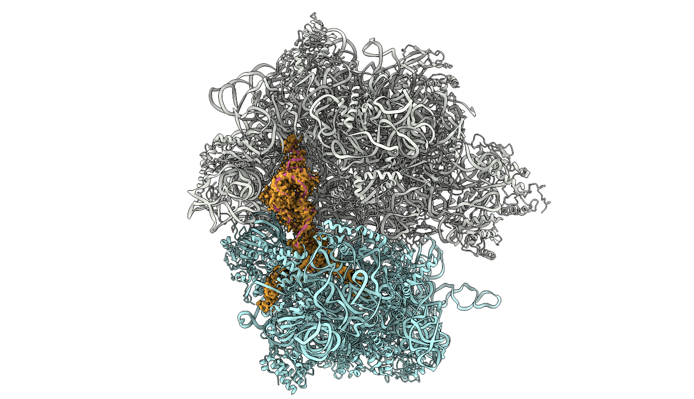

I enjoy making random figures in my spare time! Here are some of my favorites.

__I have now switched to ChimeraX in my life but have no published work with it yet__

__Cover submission for 2020 PNAS paper__  
this was a very fun first Blender project, Twitter user [@bradyajohnston](https://twitter.com/bradyajohnston)'s tutorial was magical
(_spoilers: it did not make it_)

__My favorite (so far) publication figure__  
(_PNAS 2020_)  

__Dunham lab logo I made__  
Despite what my PI says, I promise the font here is not Comic Sans  

__Two versions of the cover submission for 2019 JBC paper__  
Fun PyMol settings I don't know how to replicate  
(_spoilers: this also did not make it_)

__Of course there would be cute ribosomes__  

  
