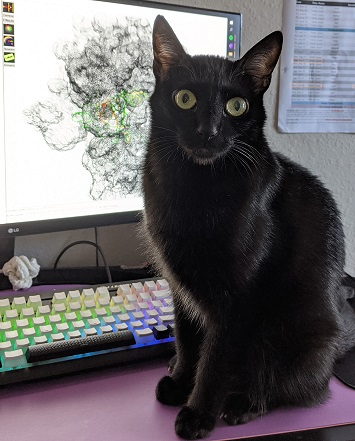

Hi! My name is Ha An Nguyen.   
I am currently a graduate student in the Chemistry PhD program at Emory University. 
I currently work in [Dr. Christine Dunham's lab](http://www.biochem.emory.edu/dunham/) studying bacterial translation regulation using biochemical and structural biology techniques. 

Areas of interest: Macromolecular X-ray crystallography, cryo-EM, RNA, ribosome

Like all structural biologists, I also have a cat! She has not contributed to any seeding though, so her scientific usefulness is still to be determined.   

